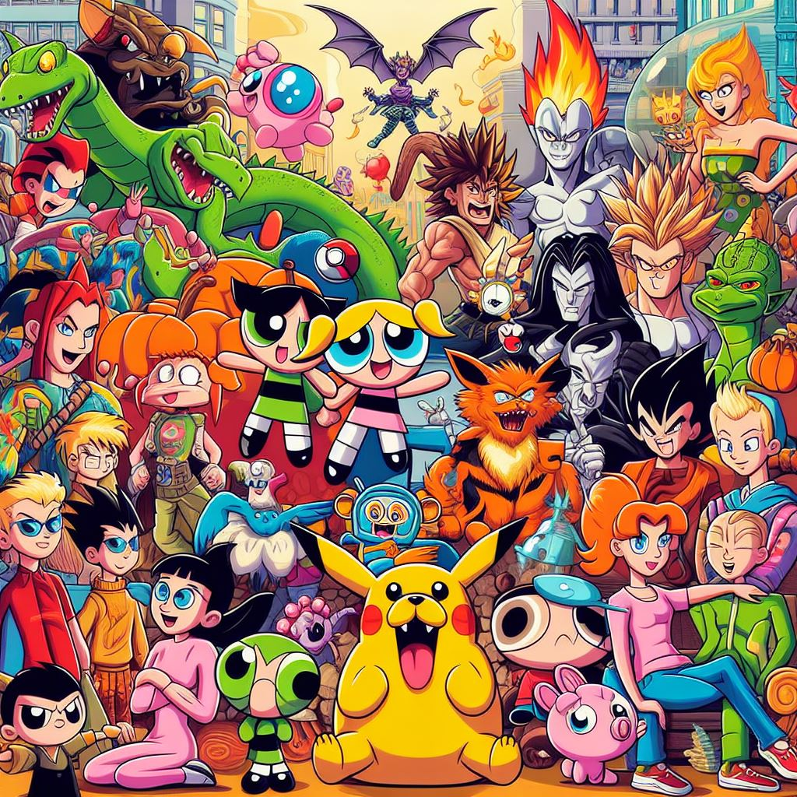

# 2000 Dose de Diversão: O Podcast dos Desenhos Nostálgicos 🚀📺✨

Bem-vindo ao repositório do "2000 Dose de Diversão: O Podcast dos Desenhos Nostálgicos", um projeto incrível do Bootcamp Santander 2024! Aqui, mergulhamos de cabeça na nostalgia dos anos 2000, relembrando os desenhos animados que marcaram uma geração. 😎🎉

## Sobre o Podcast

O "2000 Dose de Diversão" é mais do que um podcast comum - é uma experiência imersiva criada a partir da colaboração entre humanos e inteligências artificiais generativas. Com a ajuda da tecnologia mais avançada, Natiele guia os ouvintes por uma jornada repleta de curiosidades, memórias e emoções dos desenhos animados que fizeram parte da nossa infância nos anos 2000! 💥💭
[Áudio do Podcast](assets/audiopodcast.mp3)

## Ferramentas Utilizadas

- **Copilot**: Utilizamos o Copilot para auxiliar na geração de scripts dos episódios, trazendo sugestões inteligentes e agilizando o processo de criação.
- **ChatGPT**: Contamos com a ajuda do ChatGPT para desenvolver falas envolventes e curiosidades interessantes, garantindo que cada episódio seja cativante e memorável.
- **Elevenlabs.io**: Utilizamos a plataforma Elevenlabs.io para explorar e aprimorar nossas habilidades em inteligência artificial e desenvolvimento de projetos inovadores.

## Como Contribuir

1. Faça um fork deste repositório.
2. Crie uma branch para sua contribuição: `git checkout -b minha-contribuicao`.
3. Adicione ou modifique os scripts dos episódios, trazendo novas curiosidades ou ajustando o conteúdo existente para deixar tudo ainda mais emocionante! 🚀
4. Faça o commit das suas mudanças: `git commit -am 'Adicionando curiosidade sobre [desenho]`.
5. Faça o push para a branch: `git push origin minha-contribuicao`.
6. Abra um pull request, descrevendo suas alterações e compartilhando sua paixão pelos desenhos dos anos 2000! 🙌

## Agradecimentos

Um grande obrigado a todos os participantes do Bootcamp Santander 2024 que tornaram essa jornada possível, explorando as fronteiras da tecnologia e da criatividade para criar algo verdadeiramente único e especial! 🌟🎈

Prepare-se para uma jornada incrível relembrando os melhores desenhos dos anos 2000 no "2000 Dose de Diversão: O Podcast dos Desenhos Nostálgicos"! 💫📻🎶
